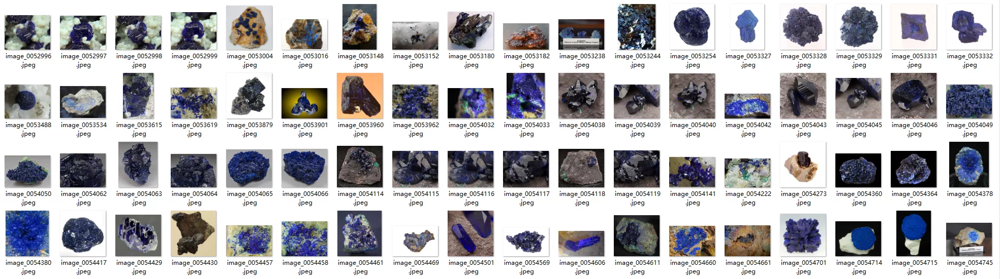
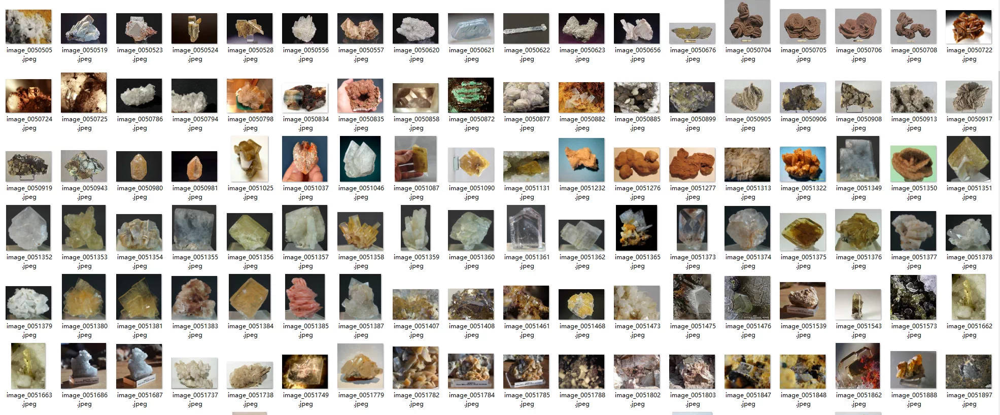
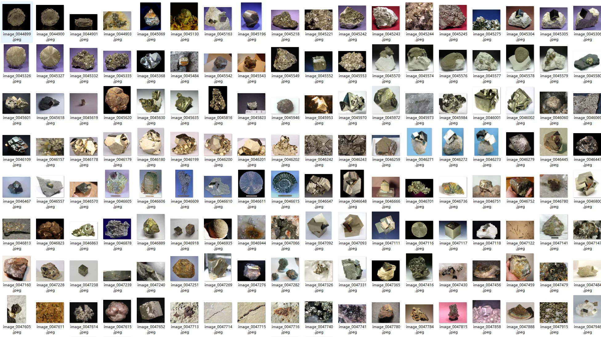
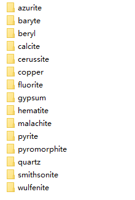
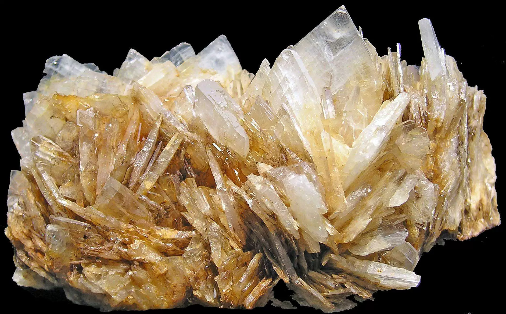
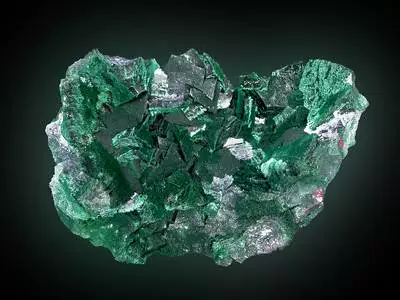
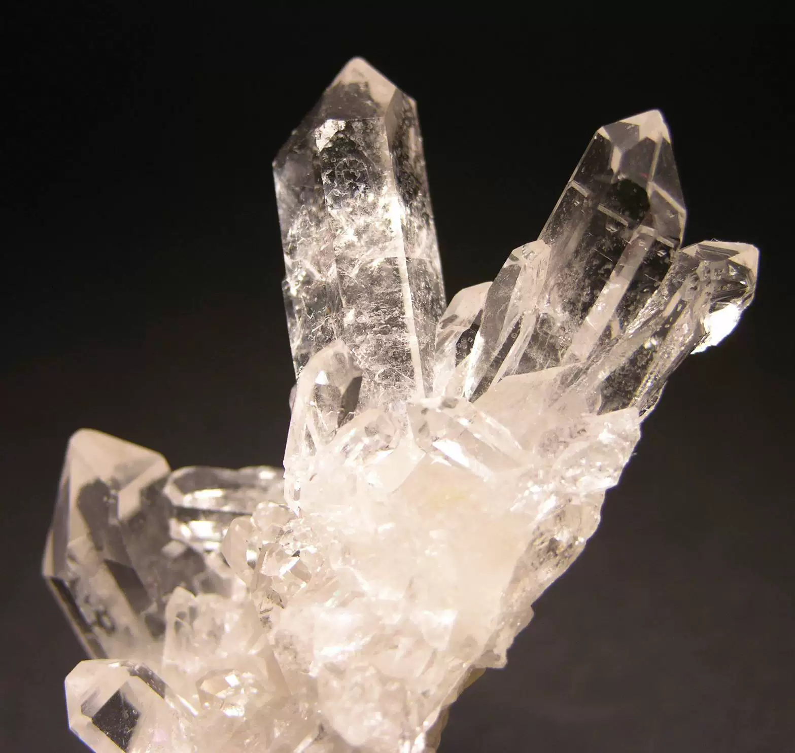

## Body

The Mineral Image Classification Dataset (15 Classes)

The Mineral Photography Dataset contains over 39,000 mineral specimen images covering 15 different mineral categories, with a size of 15GB. It is primarily designed for machine learning and computer vision tasks, especially in mineral classification and image generation. Each category includes images of minerals under various forms and lighting conditions, making it an integrated resource for training models to recognize and generate mineral images.

Key Features:
Total Images: Over 39,000 high-quality photos.

Mineral Categories: The dataset includes images of the following 15 mineral categories:
----Titania
----Barite
----Apatite
----Calcite
----Bauxite
----Copper
----Flint
----Gypsum
----Hematite
----Malachite
----Pyrite
----Lead Pentoxide
----Quartz
----Smithsonite
----Wolframite

Purpose: This dataset is very suitable for training models in mineral classification and image generation tasks.
Application Scenarios:
----Mineral Classification: Build models that can automatically classify minerals based on image data.
----Image Generation: Use the dataset to generate synthetic mineral images, which is very useful for data augmentation or GAN-based projects.
----Computer Vision: Train deep learning models in the field of mineralogy to identify and classify objects.

This dataset provides valuable resources for research involving image-based machine learning models, including mineral identification, image synthesis, and visual pattern recognition in mineralogy.
Electronic Virtual Products are Not Returnable

## Images

Here is a pay link on Stripe ( https://buy.stripe.com/3cs8yP7sY87d0vu9AB ). Please contact me lonlonago@foxmail.com after funding $89, and I will send you a complete data files , thank you!

